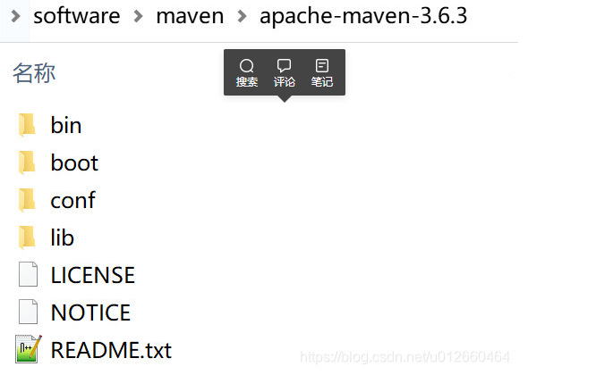
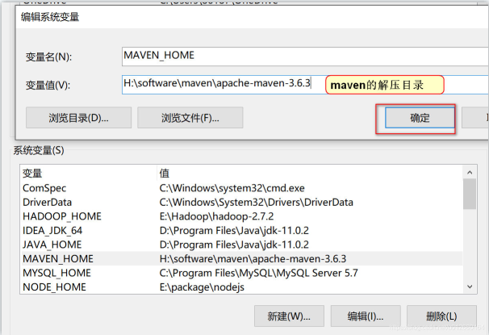
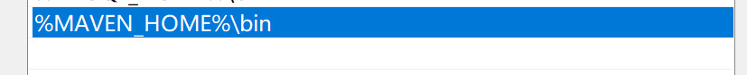
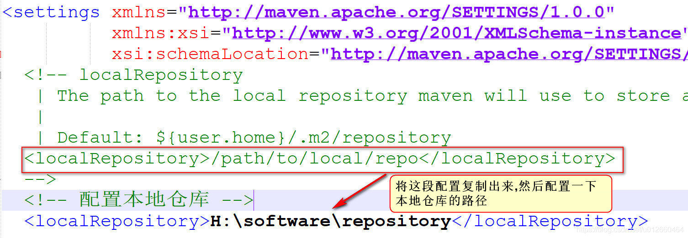

# Maven
后端包管理工具。maven自身是纯java开发的，可以使用maven对java项目进行构建、依赖管理。
## Maven安装
1. Maven 下载后，将 Maven 解压到一个没有中文没有空格的路径下，比如:H:\software\maven 下面。 解压后目录结构如下：

* bin:存放了 maven 的命令
* boot:存放了一些 maven 本身的引导程序，如类加载器等
* conf:存放了 maven 的一些配置文件，如 setting.xml 文件
* lib:存放了 maven 本身运行所需的一些 jar 包
2. 环境变量配置,配置 MAVEN_HOME ,变量值就是你的 maven 安装的路径（bin 目录之前一级目录）,并将MAVEN_HOME 添加到Path系统变量。


3. Maven 软件版本测试,win+R 打开dos窗口，通过 mvn -v命令检查 maven 是否安装成功，看到 maven 的版本为 3.6.3 及 java 版本为 jdk-11 即为安装 成功。
## Maven仓库
Maven中的仓库是用来存放maven构建的项目和各种依赖的(Jar包)。
* **本地仓库**: 位于自己计算机中的仓库, 用来存储从远程仓库或中央仓库下载的插件和 jar 包。
* **远程仓库**: 需要联网才可以使用的仓库，阿里提供了一个免费的maven 远程仓库。
* **中央仓库**: 在 maven 软件中内置一个远程仓库地址 http://repo1.maven.org/maven2 ，它是中 央仓库，服务于整个互联网，它是由 Maven 团队自己维护，里面存储了非常全的 jar 包，它包 含了世界上大部分流行的开源项目构件。
    ### 本地仓库配置
    1. 新建目标文件夹，比如H:/software/repository.
    2. 在maven安装目录中,进入 conf文件夹, 可以看到一个 settings.xml 文件中, 我们在这个文件中, 进行本地仓库的配置
    3. 打开 settings.xml文件，进行如下配置如下：
    
    ### 远程仓库配置
    Maven默认的远程仓库是在国外, 所以下载jar包时速度会非常慢, 改为阿里云仓库。
    1.打开 settings.xml,找到 标签 , 下面的内容复制到 中 即可。
    ```
    <!--setting.xml中添加如下配置-->
    <mirrors>
        <mirror>
            <id>aliyun</id>  
            <!-- 中心仓库的 mirror(镜像) -->
            <mirrorOf>central</mirrorOf>    
            <name>Nexus aliyun</name>
            <!-- aliyun仓库地址 以后所有要指向中心仓库的请求，都会指向aliyun仓库-->
            <url>http://maven.aliyun.com/nexus/content/groups/public</url>  
        </mirror>
    </mirrors>
    ```
    ### jdk配置
    在 标签中 增加 一个 标签，限定maven项目默认的jdk版本.
    内容如下：
    ```
    <profiles>
        <!-- 在已有的profiles标签中添加profile标签 -->
        <profile>    
            <id>myjdk</id>    
            <activation>    
                <activeByDefault>true</activeByDefault>    
                <jdk>1.8</jdk>    
            </activation>    
            <properties>    
                <maven.compiler.source>1.8</maven.compiler.source>    
                <maven.compiler.target>1.8</maven.compiler.target>
                <maven.compiler.compilerVersion>1.8</maven.compiler.compilerVersion> 
            </properties>    
        </profile>
    </profiles>
    <!-- 让增加的 profile生效 -->
    <activeProfiles>
        <activeProfile>myjdk</activeProfile>
    </activeProfiles>
    ```
## idea使用maven
### 新建maven项目
[详情图文-稀客大大Maven](http://i.heyige.cn/devops/maven.html#_6-2-%E5%88%9B%E5%BB%BAaven%E9%A1%B9%E7%9B%AE)
1. 在idea中新建项目，选择maven选项
2. 选择jdk版本，点击下一步
3. 指定GroupId项目标识、ArtifactId项目名、Version项目版本号，点击下一步
4. 指定项目名、项目保存位置点击finish
5. 项目结构为：
* src/main/java 存放源代码，建包，放项目中代码(service,dao,User,....)
* src/main/resources 书写配置文件，项目中的配置文件(jdbc.properties)
* src/test/java 书写测试代码，项目中测试案例代码
* src/test/resources 书写测试案例相关配置文件
* 目根/pom.xml (project object model) maven项目核心文件，其中定义项目构建方式，声明依赖等
注意：项目中的建包，建类，执行，都和普通项目无差异
### 项目配置文件pom.xml
* 基本配置
    ```
    <project > ：文件的根节点 .
    <modelversion > ： pom.xml 使用的对象模型版本
    <groupId > ：项目名称，一般写项目的域名
    <artifactId > ：模块名称，子项目名或模块名称
    <version > ：产品的版本号 .
    <packaging > ：打包类型，一般有 jar、war、pom 等
    <name > ：项目的显示名，常用于 Maven 生成的文档。
    <description > ：项目描述，常用于 Maven 生成的文档
    <dependencies> ：项目依赖构件配置，配置项目依赖构件的坐标
    <build> ：项目构建配置，配置编译、运行插件等。
    ```
***