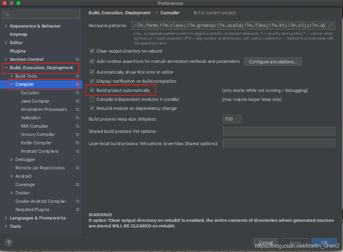
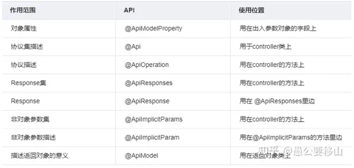

- [web](#web)
  - [spring boot](#spring-boot)
    - [RestController](#restcontroller)
    - [静态资源配置](#静态资源配置)
    - [热更新](#热更新)
    - [Restful风格](#restful风格)
    - [mybatis plus](#mybatis-plus)
    - [swagger](#swagger)
    - [上传文件](#上传文件)
    - [前端下载文件](#前端下载文件)
    - [拦截器](#拦截器)
    - [jwt](#jwt)
    - [!restcontroller注解使用爆红](#restcontroller注解使用爆红)
    - [!使用@RequestBody传递多个不同对象](#使用requestbody传递多个不同对象)

# web
## <a id='spring-boot'></a>spring boot
使用maven进行包管理。
1. 创建spring boot项目
2. 创建文件结构目录
    ```
    ...
    com.zwj.demo
      config//配置类目录
      controller//控制器目录
      entity//实体类目录
      interceptor//拦截器目录
      mapper//数据库映射目录
      util//工具类目录
    ...
    ```
3. 配置热更新
4. 配置项目与数据库的链接
5. 编写controller
6. 编写实体类
7. 编写数据映射
8. 配置数据库
   1. 建表
   2. 创建测试数据
9.  单元测试

### <a id='restcontroller'></a>RestController
RestController注解等价于类名上Controller注解加方法名上ResponseBody注解
在controller类的类名上添加@RestController注解。方法上根据请求方法区别指定访问路径。
```
//1.get方法访问test路径，请求路径中变量名与方法中变量名一致则可得到值，缺省值为null
@GetMapping("/test")
public String test(String name){
  return "ok";
}
//2.post方法访问test路径，请求体中变量名与方法中变量名一致则可得到值，缺省值为null
@PostMapping("/test")
public String test(String name){
  return "ok";
}
//3.get方法访问test路径，请求路径中变量名与RequestParam注解中声明的变量名一致则可得到值，不可缺省，如果路径中无此变量则无法访问到方法，PostMapping同理
@GetMapping("/test")
public String test(@RequestParam("name")String str){
  return "ok";
}
//4.post方法访问test路径，请求体中变量名与实体中变量名一致，则可自动封装为实体,GetMapping同理
/*
User{
  String name;
}
*/
@PostMapping("/test")
public String test(User user){
  System.out.println(user);
  return "ok";
}
//5.post方法访问test路径，请求头中需要规定Content-Type：application/json，请求体中json格式的变量名与实体中变量名一致，且变量类型严格一致，可封装为实体，变量必须使用RequestBody注解声明
@PostMapping("/test")
public String test(@RequestBody User user){
  System.out.println(user);
  return "ok";
}
```
### <a id='静态资源配置'></a>静态资源配置
* 指定位置配置
  默认静态资源存放地址为resources/static文件夹下。更改方式是在resources文件夹下创建目标文件夹，例如image文件夹，在yml文件中设置：
  ```
  /*编译后的target目录下java文件以及静态资源都会存放在classes文件夹下，classpath指代该文件夹位置*/
  spring:
    web:
      resources:
        static-locations: classpath:/image
  ```
* 过滤路径配置
  默认静态资源访问路径为/**，则在浏览器的根目录下可直接根据资源名称访问静态资源。更改方式是在yml文件中设置：
  ```
  /*修改后需要在浏览器根目录下访问image/资源名.资源后缀，访问资源*/
  spring:
    mvc:
      static-path-pattern: /image/**
  ```
### <a id='热更新'></a>热更新
1. 在pom.xml文件中导入依赖，如下：
    ```
    <dependency>
        <groupId>org.springframework.boot</groupId>
        <artifactId>spring-boot-devtoolsartifactId>
        <scope>runtime</scope>
        <optional>true</optional>
    </dependency>
    ```
1. 添加插件
    ```
    <plugin>
        <groupId>org.springframework.boogroupId>
        <artifactId>spring-boot-maven-plugiartifactId>
        <version>1.5.7.RELEASE</version>
        <configuration>
            <fork>true</fork>
            <addResources>true</addResources>
        </configuration>
    </plugin>
    ```
1. 修改配置文件
    在yml文件中添加如下代码：
    ```
    spring:
      devtools:
        restart:
          enabled: true
    ```
1. 修改idea配置
  打开自动编译选项
  Preferences --> Build,Execution,Deployment --> Compiler --> Build project automatically，勾选。
  
1. Registry配置修改
    打开Registry配置界面。
    windows快捷键：ctrl + shift + alt + /
    mac快捷键：alt + command + shift + /
    勾选compiler.automake.allow.when.app.running后关闭即可。
### <a id='restful风格'></a>Restful风格
* 特征
  **以资源为基础**：资源可以是一个图片、音乐、一个XML格式、HTML格式或者JSON格式等网络上的一个实体，除了一些二进制的资源外普通的文本资源更多以JSON为载体、面向用户的一组数据(通常从数据库中查询而得到)。
  **统一接口**: 对资源的操作包括获取、创建、修改和删除，这些操作正好对应HTTP协议提供的GET、POST、PUT和DELETE方法。
  | Http方法 | 操作 | 返回值 | 特定返回值 |
  | - | - | - | - |
  | POST | 在服务器新建一个资源 | 201 | 404/409 |
  | GET | 从服务器取出资源（一项或多项） | 200 | 404 |
  | PUT | 在服务器更新资源（客户端提供完整资源数据） | 200/204 | 404/405 |
  | PATCH | 在服务器更新资源（客户端提供需要修改的资源数据） | 200/204 | 404 |
  | DELETE | 从服务器删除资源 | 200 | 404/405 |
* 动态路径
  例如某controller内的某get方法
  ```
  //{id}内id为动态变化的test主键，PathVariable注解意为方法内的id变量从路径中取值，方法内变量名与{}内变量名保持一致
  @GetMapping("/test/{id}")
  public String getTestById(@PathVariable int id){
    return "id";
  }
  ```
### <a id='mybatis-plus'></a>mybatis plus
1. 添加依赖
  * 前提依赖
    ```
    <dependency>
          <groupId>org.springframework.boot</groupId>
          <artifactId>spring-boot-starter</artifactId>
      </dependency>
      <dependency>
          <groupId>org.springframework.boot</groupId>
          <artifactId>spring-boot-starter-test</artifactId>
          <scope>test</scope>
      </dependency>
    ```
  * 直接依赖
    ```
    <dependency>
        <groupId>com.baomidou</groupId>
        <!--下面坐标根据自己使用的SpringBoot版本二选一-->
        <!--SpringBoot2使用此版本-->
        <artifactId>mybatis-plus-boot-starter</artifactId>
        <!--3.5.4开始,支持SpringBoot3使用此版本-->
        <artifactId>mybatis-plus-spring-boot3-starter</artifactId>
        <version>最新版本</version>
    </dependency>
    <!--数据库依赖，用什么数据库使用什么依赖，以mysql为例-->
    <dependency>
          <groupId>mysql</groupId>
          <artifactId>mysql-connector-java</artifactId>
          <version>5.1.47</version>
    </dependency>
    ```
2. 配置
  在yml文件中配置，数据库以mysql为例。
  ```
  spring:
    datasource:
      driver-class-name: com.mysql.jdbc.Driver
      url: jdbc:mysql://localhost:3306/test?useSSL=false
      username: root
      password: xxl52ni
  ```
1. 在主类上添加MapperScan注解
  指明数据库映射类存放地址
  `@MapperScan("com.zwj.tryapp.mapper")`
1. 创建实体类
  * 在entity目录下新建实体类
  * 在实体类上使用tablename注解注明数据库内要操作的表名`@TableName("`user`")`
2. 创建数据映射类
  * 在mapper目录下新建数据映射类
  * 编写sql语句及方法
    ```
    /*
    User{
      String name;
      String age;
    }
    */
    public interface UserMapper extends BaseMapper<User> {
      @Insert("insert into user values(#{name},#{age})")
      int add(User user)
    }
    ```
### <a id='swagger'></a>swagger
接口文档生成器
1. 添加依赖包
  前提是已经导入了spring boot的web包。
  ```
          <dependency>
              <groupId>io.springfox</groupId>
              <artifactId>springfox-swagger2</artifactId>
              <version>2.9.2</version>
          </dependency>
          <dependency>
              <groupId>io.springfox</groupId>
              <artifactId>springfox-swagger-ui</artifactId>
              <version>2.9.2</version>
          </dependency>
  ```
1. 配置swagger
  要使用swagger，我们必须对swagger进行配置，我们需要创建一个swagger的配置类，比如可以在config文件目录下创建一个命名为SwaggerConfig.java的java类
  ```
  package com.example.config;

  import org.springframework.context.annotation.Bean;
  import org.springframework.context.annotation.Configuration;
  import springfox.documentation.builders.ApiInfoBuilder;
  import springfox.documentation.builders.PathSelectors;
  import springfox.documentation.builders.RequestHandlerSelectors;
  import springfox.documentation.service.ApiInfo;
  import springfox.documentation.spi.DocumentationType;
  import springfox.documentation.spring.web.plugins.Docket;
  import springfox.documentation.swagger2.annotations.EnableSwagger2;

  @Configuration // 标明是配置类
  @EnableSwagger2 //开启swagger功能
  public class SwaggerConfig {
      @Bean
      public Docket createRestApi() {
          return new Docket(DocumentationType.SWAGGER_2)  // DocumentationType.SWAGGER_2 固定的，代表swagger2
          //.groupName("分布式任务系统") // 如果配置多个文档的时候，那么需要配置groupName来分组标识
                  .apiInfo(apiInfo()) // 用于生成API信息
                  .select() // select()函数返回一个ApiSelectorBuilder实例,用来控制接口被swagger做成文档
                  // 扫描指定包下的接口，最为常用
                  .apis(RequestHandlerSelectors.basePackage("com.xxxx.project.tool.swagger"))
                  //.withClassAnnotation(RestController.class) // 扫描带有指定注解的类下所有接口
                  //.withMethodAnnotation(PostMapping.class) // 扫描带有指定注解的方法接口
                  //.apis(RequestHandlerSelectors.any()) // 扫描所有
                  
                  // 选择所有的API,如果你想只为部分API生成文档，可以配置这里
                  .paths(PathSelectors.any()
                    //.any() // 满足条件的路径，该断言总为true
                      //.none() // 不满足条件的路径，该断言总为false（可用于生成环境屏蔽 swagger）
                      //.ant("/user/**") // 满足字符串表达式路径
                      //.regex("") // 符合正则的路径
          )
                  .build();
      }

      /**
      * 用于定义API主界面的信息，比如可以声明所有的API的总标题、描述、版本
      * @return
      */
      private ApiInfo apiInfo() {
      
          Contact contact = new Contact(
                  "我是作者姓名", // 作者姓名
                  "https://blog.csdn.net/", // 作者网址
                  "123456789@163.com"); // 作者邮箱
                  
          return new ApiInfoBuilder()
                  .title("XX项目API") //  可以用来自定义API的主标题
                  .description("XX项目SwaggerAPI管理") // 可以用来描述整体的API
                  .termsOfServiceUrl("https://www.baidu.com") // 用于定义服务的域名（跳转链接）
                  .version("1.0") // 可以用来定义版本
                  .license("Swagger-的使用教程")
                  .licenseUrl("https://blog.csdn.net")
                  .contact(contact)
                  .build(); //
      }
  }
  ```
  如果需要配置多个组的话，就需要配置多个 docket() 方法.
3. controller类中配置
  ```
  @Api("Hello控制类")
  @RestController 
  public class HelloController {
      @GetMapping(value = "/user")
      public User getUser(){
          return new User("愚公要移山","123456");
      }
      @ApiOperation("可以指定参数的API")
      @PostMapping("/param")
      public String hello2(@ApiParam("用户名") String name){
          return "hello" + name;
      }
  }
  ```
  详细描述字段
  
4. 隐藏
  有时候自己写的controller，或者是controller里面的接口方法不想让前端人员看到，我们可以隐藏即可。
  * 隐藏整个controller
    ```
    @ApiIgnore
    @RestController
    public class MyController {
        //方法
    }
    ```
  * 隐藏某个接口方法1
    ```
    @ApiIgnore
    @ApiOperation(value = "描述信息")
    @GetMapping("/getAuthor")
    public String getAuthor() {
        return "愚公要移山";
    }
    ```
  * 隐藏某个接口方法2
    ```
    @ApiOperation(value = "描述信息", hidden = true)
    @GetMapping("/get")
    public LocalDate getDate() {
        return LocalDate.now();
    }
    ```
5. 查看效果
  浏览器访问`项目网址/swagger-ui.html`
### <a id='上传文件'></a>上传文件
1. 修改yml文件，spring boot嵌入的tomcat限制了请求文件的大小，每个文件配置最大为1mb，单词请求的文件的总数不能大于10mb。因此需要在yml文件中配置更改大小限制。
  ```
  spring:
    servlet:
      multipart:
        max-file-size: 10MB
        max-request-size: 10MB
  ```
2. 前端表单提交文件的编码方式必须为multipart/form-data。
  ```
  <form action="/upload" method="post" enctype="multipart/form-data">
      <input type="file" name="file">
      <button type="submit">Upload</button>
  </form>
  ```
3. 编写Controller处理文件上传请求
  ```
  import org.springframework.web.bind.annotation.*;
  import org.springframework.web.multipart.MultipartFile;
  import java.io.File;
  import java.io.IOException;
  
  @RestController
  public class FileUploadController {
      //此处RequestParam声明中的值应于上传文件的文件名一致
      @PostMapping("/upload")
      public String handleFileUpload(@RequestParam("file") MultipartFile file) {
          if (file.isEmpty()) {
              return "Please select a file to upload.";
          }
          try {
              byte[] bytes = file.getBytes();
              String uploadDir = "/path/to/upload/directory/";
              File uploadedFile = new File(uploadDir + file.getOriginalFilename());
              file.transferTo(uploadedFile);
              return "File uploaded successfully!";
          } catch (IOException e) {
              e.printStackTrace();
              return "File upload failed!";
          }
      }
  }
  ```
### <a id='前端下载文件'></a>前端下载文件
编写Controller处理文件下载请求。
```
import org.springframework.core.io.Resource;
import org.springframework.http.HttpHeaders;
import org.springframework.http.MediaType;
import org.springframework.http.ResponseEntity;
import org.springframework.stereotype.Controller;
import org.springframework.web.bind.annotation.GetMapping;
import org.springframework.web.bind.annotation.PathVariable;
import org.springframework.web.bind.annotation.ResponseBody;
import org.springframework.web.servlet.mvc.method.annotation.MvcUriComponentsBuilder;
import java.io.IOException;
import java.nio.file.Files;
import java.nio.file.Path;
import java.nio.file.Paths;
import java.util.List;
import java.util.stream.Collectors;
 
@RestController
public class FileDownloadController {
 
    private static final String FILE_DIRECTORY = "/path/to/upload/directory/";
 
    @GetMapping("/download/{fileName:.+}")
    public ResponseEntity<Resource> downloadFile(@PathVariable String fileName) {
        Path filePath = Paths.get(FILE_DIRECTORY).resolve(fileName).normalize();
        try {
            Resource resource = new org.springframework.core.io.UrlResource(filePath.toUri());
            if (resource.exists() || resource.isReadable()) {
                return ResponseEntity.ok()
                        .contentType(MediaType.APPLICATION_OCTET_STREAM)
                        .header(HttpHeaders.CONTENT_DISPOSITION, "attachment; filename=\"" + resource.getFilename() + "\"")
                        .body(resource);
            } else {
                return ResponseEntity.notFound().build();
            }
        } catch (IOException ex) {
            ex.printStackTrace();
            return ResponseEntity.status(500).build();
        }
    }
}
```
### <a id='拦截器'></a>拦截器
* 基于url实现的拦截器
1. 创建登录拦截器类
  ```
  public class LoginInterceptor extends HandlerInterceptorAdapter{  
      /**  
      * 在请求处理之前进行调用（Controller方法调用之前）  
      * 基于URL实现的拦截器  
      * @param request  
      * @param response  
      * @param handler  
      * @return  
      * @throws Exception  
      */  
      @Override  
      public boolean preHandle(HttpServletRequest request, HttpServletResponse response, Object handler) throws Exception {  
          String path = request.getServletPath();  
          if (path.matches(Const.NO_INTERCEPTOR_PATH)) {  
              //不需要的拦截直接过  
              return true;  
          } else {  
              // 这写你拦截需要干的事儿，比如取缓存，SESSION，权限判断等  
              System.out.println("====================================");  
              return true;  
          }  
      }  
  } 
  ```
  关键代码：path.matches(Const.NO_INTERCEPTOR_PATH )就是基于正则匹配的url。
  ```
  /**  
  * @author     BianP  
  * @explain 常量类  
  */  
  public class Const {  
      public static final String SUCCESS = "SUCCESS";  
      public static final String ERROR = "ERROR";  
      public static final String FIALL = "FIALL";  
      /**********************对象和个体****************************/  
      public static final String SESSION_USER = "loginedAgent"; // 用户对象  
      public static final String SESSION_LOGINID = "sessionLoginID"; // 登录ID  
      public static final String SESSION_USERID = "sessionUserID"; // 当前用户对象ID编号  
      public static final String SESSION_USERNAME = "sessionUserName"; // 当前用户对象ID编号  
      public static final Integer PAGE = 10; // 默认分页数  
      public static final String SESSION_URL = "sessionUrl"; // 被记录的url  
      public static final String SESSION_SECURITY_CODE = "sessionVerifyCode"; // 登录页验证码 
      // 时间 缓存时间  
      public static final int TIMEOUT = 1800;// 秒  
      public static final String ON_LOGIN = "/logout.htm";  
      public static final String LOGIN_OUT = "/toLogout";  
      // 不验证URL anon：不验证/authc：受控制的  
      public static final String NO_INTERCEPTOR_PATH =".*/((.css)|(.js)|(images)|(login)|(anon)).*";  
  } 
  ```
2. 把拦截器添加到配置中,创建配置类：
  ```
  /**  
  * 和springmvc的webmvc拦截配置一样  
  * @author BIANP  
  */  
  @Configuration  
  public class WebConfigurer implements WebMvcConfigurer {  
      @Override  
      public void addInterceptors(InterceptorRegistry registry) {  
          // 拦截所有请求，通过判断是否有 @LoginRequired 注解 决定是否需要登录  
          registry.addInterceptor(LoginInterceptor()).addPathPatterns("/**");  
          registry.addInterceptor(AuthorityInterceptor()).addPathPatterns("/**");  
      }  
      @Bean  
      public LoginInterceptor LoginInterceptor() {  
          return new LoginInterceptor();  
      }  
      @Bean  
      public AuthorityInterceptor AuthorityInterceptor() {  
          return new AuthorityInterceptor();  
      }  
  } 
  ```
### <a id='jwt'></a>jwt
JSON Web Token（JSON Web令牌）。
* 作用：
  1. 授权：一旦用户登录，每个后续请求将包括JWT，从而允许用户访问该令牌允许的路由，服务和资源。它的开销很小并且可以在不同的域中使用。如：单点登录。
  2. 信息交换：在各方之间安全地传输信息。JWT可进行签名（如使用公钥/私钥对），因此可确保发件人。由于签名是使用标头和有效负载计算的，因此还可验证内容是否被篡改。
* 使用：
  1. 引入依赖
    ```
    <!--引入JWT-->
    <dependency>
        <groupId>com.auth0</groupId>
        <artifactId>java-jwt</artifactId>
        <version>3.10.0</version>
    </dependency>
    ```
  2. 生成token
    ```
    HashMap<String,Object> map = new HashMap<>();
            Calendar instance = Calendar.getInstance();
            instance.add(Calendar.SECOND,20);
            String token = JWT.create()
                    .withHeader(map) //可以不设定，就是使用默认的
                    .withClaim("userId",20)//payload  //自定义用户名
                    .withClaim("username","zhangsan")
                    .withExpiresAt(instance.getTime()) //指定令牌过期时间
                    .sign(Algorithm.HMAC256("fdahuifeuw78921"));//签名
    ```
  3. 根据令牌和签名解析数据
    ```
    JWTVerifier jwtVerifier = JWT.require(Algorithm.HMAC256("fdahuif921")).build();
            DecodedJWT decodedJWT = jwtVerifier.verify(token);
            decodedJWT.getClaim("userId").asInt();//获取负载里面对应的内容
            decodedJWT.getClaim("username").asString();
            decodedJWT.getExpiresAt();//获取过期时间
    ```
  4. 常见异常信息
    ```
    SignatureVerificationException //签名不一致异常
    TokenExpiredException //令牌过期异常
    AlgorithmMismatchException //算法不匹配异常
    InvalidClaimException //失效的payload异常（传给客户端后，token被改动，验证不一致）
    ```
  5. 封装工具类
    ```
    public class JWTUtils {
        private static String SIGNATURE = "token!@#$%^7890";

        /**
        * 生成token
        * @param map //传入payload
        * @return 返回token
        */
        public static String getToken(Map<String,String> map){
            JWTCreator.Builder builder = JWT.create();
            map.forEach((k,v)->{
                builder.withClaim(k,v);
            });
            Calendar instance = Calendar.getInstance();
            instance.add(Calendar.SECOND,7);
            builder.withExpiresAt(instance.getTime());
            return builder.sign(Algorithm.HMAC256(SIGNATURE)).toString();
        }

        /**
        * 验证token
        * @param token
        */
        public static void verify(String token){
            JWT.require(Algorithm.HMAC256(SIGNATURE)).build().verify(token);
        }

        /**
        * 获取token中payload
        * @param token
        * @return
        */
        public static DecodedJWT getToken(String token){
            return JWT.require(Algorithm.HMAC256(SIGNATURE)).build().verify(token);
        }
    }
    ```
  * spring boot整合jwt
    1. 登录时生成token
      ```
      //controller层接收数据，生成token，并响应
      Map<String,Object> map = new HashMap<>();
      try{
          User userDB = userService.login(user);
          Map<String,String> payload = new HashMap<>();
          payload.put("id",userDB.getId());
          payload.put("name",userDB.getName());
          //生成JWT令牌
          String token = JWTUtils.getToken(payload);
          map.put("state",true);
          map.put("msg","认证成功");
          map.put("token",token);//响应token
      } catch (Exception e) {
          map.put("state","false");
          map.put("msg",e.getMessage());
      }
      ```
    2. 声明一个token拦截器类
      ```
      package com.liup.interceptor;

      import com.auth0.jwt.exceptions.AlgorithmMismatchException;
      import com.auth0.jwt.exceptions.SignatureVerificationException;
      import com.auth0.jwt.exceptions.TokenExpiredException;
      import com.fasterxml.jackson.databind.ObjectMapper;
      import com.office.utils.JWTUtils;
      import org.springframework.web.servlet.HandlerInterceptor;

      import javax.servlet.http.HttpServletRequest;
      import javax.servlet.http.HttpServletResponse;
      import java.util.HashMap;
      import java.util.Map;

      /**
      * JWT验证拦截器
      */
      public class JWTInterceptor implements HandlerInterceptor {

          @Override
          public boolean preHandle(HttpServletRequest request, HttpServletResponse response, Object handler) throws Exception {
              Map<String,Object> map = new HashMap<>();
              //令牌建议是放在请求头中，获取请求头中令牌
              String token = request.getHeader("token");
              try{
                  JWTUtils.verify(token);//验证令牌
                  return true;//放行请求
              } catch (SignatureVerificationException e) {
                  e.printStackTrace();
                  map.put("msg","无效签名");
              } catch (TokenExpiredException e) {
                  e.printStackTrace();
                  map.put("msg","token过期");
              } catch (AlgorithmMismatchException e) {
                  e.printStackTrace();
                  map.put("msg","token算法不一致");
              } catch (Exception e) {
                  e.printStackTrace();
                  map.put("msg","token失效");
              }
              map.put("state",false);//设置状态
              //将map转化成json，response使用的是Jackson
              String json = new ObjectMapper().writeValueAsString(map);
              response.setContentType("application/json;charset=UTF-8");
              response.getWriter().print(json);
              return false;
          }
      }
      ```
    3. 配置拦截器
      ```
      package com.liup.config;

      import com.office.interceptor.JWTInterceptor;
      import org.springframework.context.annotation.Configuration;
      import org.springframework.web.servlet.config.annotation.InterceptorRegistry;
      import org.springframework.web.servlet.config.annotation.WebMvcConfigurer;

      @Configuration
      public class InterceptorConfig implements WebMvcConfigurer {

          @Override
          public void addInterceptors(InterceptorRegistry registry) {
              registry.addInterceptor(new JWTInterceptor())
                      .addPathPatterns("/**")
                      .excludePathPatterns("/user/**");
          }
      }
      ```
### <a id='restcontroller注解使用爆红'></a>!restcontroller注解使用爆红
**解决方法**：
1. 在pom.xml文件中添加web依赖，具体如下：
  ```
  <dependency>
        <groupId>org.springframework.boot</groupId>
        <artifactId>spring-boot-starter-web</artifactId>
  </dependency>
  ```
2. 刷新项目，如果注解仍然爆红，那么给web依赖指定具体的版本号，例如：
  ```
  <dependency>
        <groupId>org.springframework.boot</groupId>
        <artifactId>spring-boot-starter-web</artifactId>
        <version>2.1.4.RELEASE<version>
  </dependency>
  ```
### <a id='使用@requestbody传递多个不同对象'></a>!使用@RequestBody传递多个不同对象
[详情](https://blog.csdn.net/qq_45752401/article/details/115958109)
***