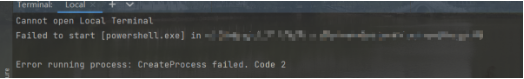
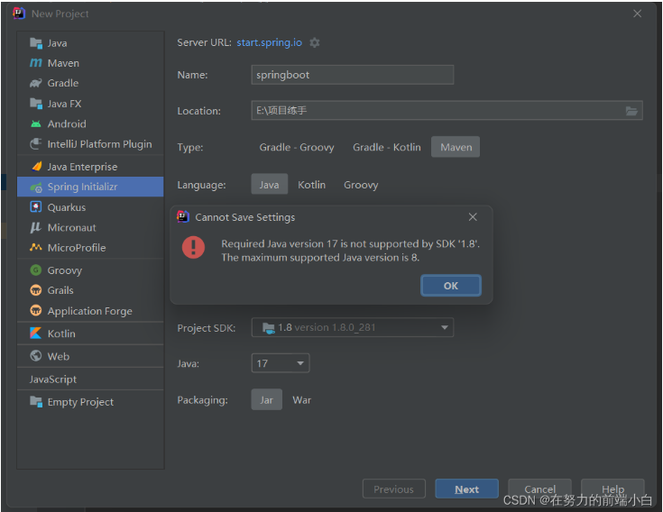
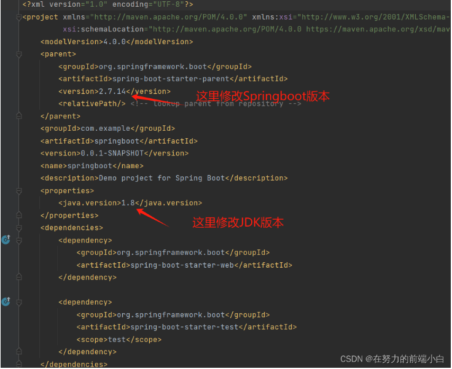

# markdown
* [基本语法](https://markdown.com.cn/basic-syntax/)
***
# VS code
## 快捷建
```
ctrl+shift+n 新开一个vscode
ctrl+shift+` 新建终端
ctrl+shift+p 唤起命令面板
ctrl+shitf+v markdown语法开启预览面板
alt+点击多行 同时多行输入 
alt+shift+点击开始、结束行 快速选择多行同时输入
```
## 插件
> markdown all in one 包含md语法高亮、调用命令行生成目录
> Vue - Official vue包
***
# idea
## 快捷方式
```
tab 选中的一行或多行代码缩进
shift+tab 选中的一行或多行代码向前缩进
```
## ！idea无法启动终端
**问题描述**：

**解决方法**：打开右上角 文件–> 设置–> 工具–> 终端 找到应用程序下Shell路径文本框中是powershell.exe文件，修改成cmd.exe，点击应用，重新启动终端。
## ！idea终端执行mvn命令提示mvn不是内部命令
**问题描述**：

**解决方法**：
1. 检查项目maven设置是否为idea自带的maven，如果是则改为自己安装的maven
2. 检查环境变量是否配置正确
3. 将idea安装路径下的 plugins\maven\lib\maven3\bin 下的文件替换成新的apache-maven-3.6.3\bin下的文件或者删除
## ！idea新建项目java可选版本过高
**问题描述**：

**解决方法**：
1. 替换下载数据源
可以将Server URL中的https://start.spring.io/ 替换成 https://start.aliyun.com/阿里云的下载地址，再选择java版本可以看到java 8
2. 直接根据Java21或者Java17创建项目
创建项目后，将pom.xml文件里面的版本改成Java8，如图：

## ！idea打开maven项目不显示maven快捷工具
**解决方法**：
* 1. 在IDEA中，同时按下Ctrl+Shift+A键呼出快捷指令栏，并在搜索框中输入Maven
  2. 点击Add Maven Projects
  3. 选择项目中的pom.xml文件
  4. 点击确定即可
* 1. 点击菜单栏View→Tool Windows→Maven
  2. 之后右侧便出现Maven窗口。
## ！idea每次打开新项目都需重新配置maven
**解决方法**：
1. 选择file>other settings>settings for new projets选项（如果没有此路径，可能你的IDEA版本比较新，路径为file>new projects settings>settings for new projets）
2. 选择build，execution，deployment>build tools>maven选项，配置maven home dictionary和user settings file，内容为自己安装的maven位置，点击应用，即可成功配置maven全局配置。
***